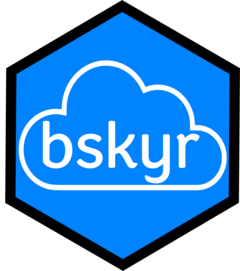

<!-- README.md is generated from README.Rmd. Please edit that file -->

# bskyr 

<!-- badges: start -->

[](https://lifecycle.r-lib.org/articles/stages.html#experimental)
<!-- badges: end -->

bskyr provides an interface to the Bluesky API, allowing you to interact
with Bluesky Social from R. To do this, we provide functions which match
with the [AT Protocol’s Lexicon](https://atproto.com/guides/lexicon),
which is like using regular HTTP requests. Outputs from `bskyr`’s
functions are primarily `tibble`s, allowing for easy analysis of the
outputs from the API calls.

`bskyr` is currently under development. The first set of functions were
focused on getting information. The second (and current) set of work is
handling posts in a friendly way.

## Installation

You can install the development version of `bskyr` from
[GitHub](https://github.com/) with:

``` r
# install.packages('devtools')
remotes::install_github('christopherkenny/bskyr')
```

## Posting with `bskyr`

Posting capabilities are still under development.

``` r
library(bskyr)
```

Text posts can be made as follows:

``` r
bs_post('Your text goes here.')
```

## Authentication

To authenticate, you first need to make an App Password. To do this, go
to <https://bsky.app/settings>. Under “Advanced” click App passwords and
then “Add App Password.”

Once you have a password, you need to run:

``` r
set_bluesky_user('yourhandle.bsky.social')
set_bluesky_pass('the-app-password')
```

If you want this to persist across sessions, set `install = TRUE`. This
will save your credentials in your R environment file.

Alternatively, you can set them manually using
`usethis::edit_r_environ()` and adding lines like so:

    BLUESKY_APP_USER='YOUR-USERNAME.bsky.social'
    BLUESKY_APP_PASS='your-apps-pass-word'
